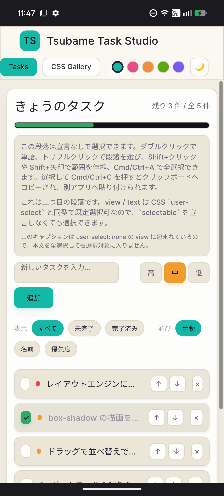
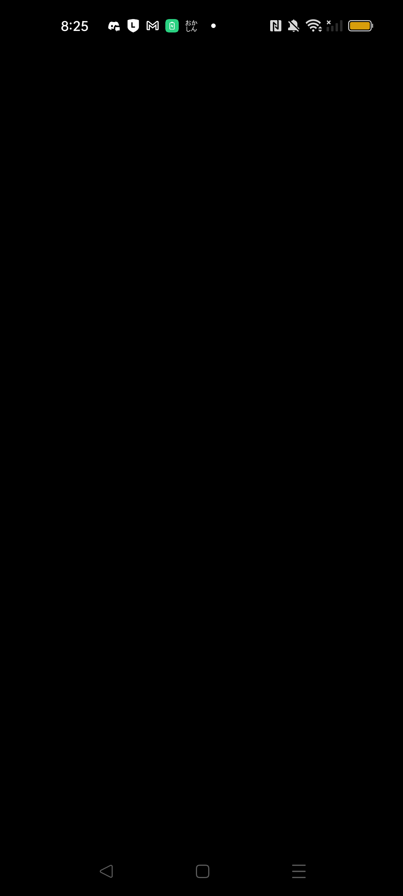
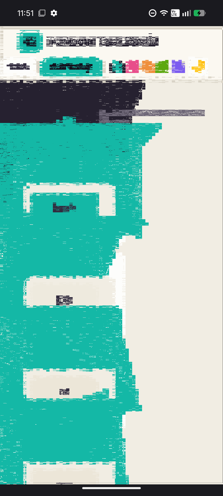
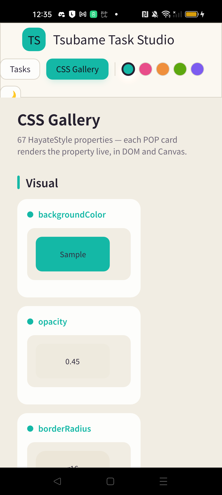
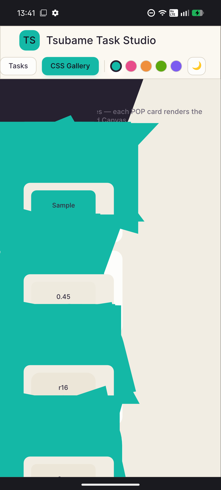

# 調査記録: Nothing Phone 3a（Adreno 810）で vello/wgpu のパス描画が破綻する — 実機切り分けと「vello ネイティブ経路を諦める」根拠

**日付: 2026-07-12**
**対象: Android ネイティブ描画（`hayate-adapter-android` → vello → wgpu-native）**
**結論: Android の vello/wgpu 経路は Adreno 810 で救済不能。skia-safe（[ADR-0146](../adr/0146-skia-safe-native-scene-renderer.md)）へ切り替える（[ADR-0147](../adr/0147-abandon-vello-native-on-adreno-adopt-skia.md)）。**

> このファイルは ADR とは別に、「なぜ vello を諦めるのか」「どこまで潰したのか」を後から誰でも検証・再現できるよう、実機の一次証拠と推論の連鎖を残すためのもの。ADR は決定の要約、こちらは根拠の全記録。

---

## 0. 要約（先に結論）

Nothing Phone 3a（実 GPU = **Adreno 810**）で、複雑なシーン（Tsubame Task Studio の「CSS Gallery」ページ）の**パス描画（角丸・シャドウ）が巨大なギザギザ多角形の塊に破綻**する。単純なページ（Tasks）は正常。同一端末の Chrome（WebGPU / Dawn）では vello が正常描画する。

実機で以下を総当たりし、**vello の枠内で再ビルド不要／少改修で直せる構成は存在しない**ことを確定した:

| # | 変えたもの | 期待 | 実機結果 |
|---|---|---|---|
| 1 | Vulkan → **GL** バックエンド | Vulkan ドライバ回避 | 🔴 **同一破綻**（Adreno 810）。Adreno 620 では GL は device 生成すら失敗 |
| 2 | Area → **MSAA8 / MSAA16** | AA 経路差し替え | 🔴 **悪化**（画面全体が砂嵐状に総崩れ）|
| 3 | Naga → **Tint** の SPIR-V（passthrough）| シェーダ変換が犯人なら直る | 🔴 **破綻不変** → シェーダ変換は無罪 |
| 4 | **wgpu を新版へ bump** | upstream 修正取り込み | ❌ v30 CHANGELOG に該当修正なし・既知 Adreno issue は未修正のドライババグ |

3 で **犯人はシェーダ変換（Naga）ではなく wgpu-hal の Vulkan 駆動そのもの**に絞り込まれた。Dawn は同じ Tint SPIR-V を同じ Adreno ドライバに渡して正常に動くため、差は「Dawn が持つ Adreno 回避策を wgpu-native が持たない」点にある。upstream に修正はなく、根治には wgpu-hal（Dawn との差分）に踏み込む深い調査が要る。それは費用対効果が読めないため、**vello 以外（skia-safe＝Google 自身の Adreno 実績を持つレンダラ）へ切り替える**。

---

## 1. 症状と初期状態（この調査の入口）

- 端末: Nothing Phone 3a（`ro.product.model=A059`, `manufacturer=Nothing`）。
  - **重要な訂正**: [ADR-0145](../adr/0145-android-vello-aa-and-wgpu-backend-runtime-switch.md) / [ADR-0146](../adr/0146-skia-safe-native-scene-renderer.md) は「Adreno **710**」と記述しているが、実機 `adapter.get_info()` は **`Adreno (TM) 810`** を返す。以降は 810 が正。
- 対照端末: OPPO Reno5（`adapter.get_info()` = `Adreno (TM) 620`。ADR-0145 は 618 と記述）。**adb で到達できるのは OPPO のみ**というのがこの調査の初期制約だった（NP3a は当初 USB デバッグ不可）。後に NP3a も物理接続で adb 到達可能になり、本命の実機検証ができた。
- 再現手順: `torimi.debug` を起動 → DevServerSetupActivity で「TODO (SOLID)」を選択 → Tsubame Task Studio が起動 → 上部タブ「CSS Gallery」をタップ。
- 既定構成: `DEFAULT_WGPU_BACKEND = Vulkan`, `DEFAULT_AA_METHOD = Area`（[render_config.rs](../../crates/platform/mobile/android/src/render_config.rs) / [vello lib.rs](../../crates/scene-renderers/vello/src/lib.rs)）。

**再現（NP3a / Vulkan + Area）:** CSS Gallery が破綻。角丸カード・シャドウが teal のギザギザ多角形の塊になり、"Sample" / "0.45" / "r16" カードを突き破る。Tasks ページは同構成で正常。


*NP3a・Vulkan+Area・Tasks ページ = 正常（単純シーンは壊れない）*


*NP3a・Vulkan+Area・CSS Gallery = 破綻（複雑シーンで発生）。これが直したかったバグ*

ログ（NP3a）:
```
render config — backend=vulkan aa=area
GPU adapter — name=Adreno (TM) 810 backend=Vulkan driver=Qualcomm ... Driver Build: f1c98d72b3 ... Date:07/11/25
```

---

## 2. 実験1 — バックエンドを GL にする（[ADR-0145](../adr/0145-android-vello-aa-and-wgpu-backend-runtime-switch.md) の切替スイッチ）

ADR-0145 の仮説は「容疑は wgpu-native の **Vulkan 経路** × Adreno ドライバ」。ならば GL で直るはず。

### 2a. OPPO（Adreno 620）: GL は初期化すら不能

```
render config — backend=gl aa=area
GPU adapter — name=Adreno (TM) 620 backend=Gl driver_info=OpenGL ES 3.2 ...
GPU init failed: request_device: Limit 'max_storage_buffers_per_shader_stage' value 8 is better than allowed 4
```

`DeviceDescriptor::default()`（= `Limits::default()`、`max_storage_buffers_per_shader_stage = 8`）を Adreno 620 の GLES（上限 4）が拒否 → device 生成失敗 → 黒画面。vello は compute 主体でこの上限を下げても今度はパイプライン生成が落ちるため、**vello + GL は Adreno GLES では原理的に動かない**。


*OPPO・GL = device 生成失敗で黒画面*

### 2b. NP3a（Adreno 810）: GL は初期化成功、しかし破綻は Vulkan と同一

```
render config — backend=gl aa=area
GPU adapter — name=Adreno (TM) 810 backend=Gl driver_info=OpenGL ES 3.2 V@0800.49 ...
（GPU init failed は出ない）
```

810 の GLES は通る（620 と違い黒画面にならない）が、**CSS Gallery の破綻は Vulkan+Area とピクセル単位で同一**。


*NP3a・GL+Area = Vulkan+Area と瓜二つの破綻。**backend 非依存**の決定的証拠*

**結論(1): バグは backend 非依存。ADR-0145 の「Vulkan 経路が犯人」仮説は誤り。** Vulkan と GL に共通する層が原因。

---

## 3. 実験2 — AA 方式（Area → MSAA8 / MSAA16）

ADR-0145 のもう一つの容疑「Area AA（compute atomics 依存）」。`DEFAULT_AA_METHOD` を差し替えて実機確認。

- OPPO（Adreno 620）: MSAA8 は角丸エッジが櫛状に破綻、MSAA16 も同様（単純な矩形シーンですら壊れる）。
- **NP3a（Adreno 810）: Vulkan+MSAA8 は CSS Gallery だけでなく画面全体が砂嵐状に総崩れ**（Area より遥かに悪い）。


*NP3a・Vulkan+MSAA8 = 画面全体が砂嵐状に破壊。MSAA は救済にならず、むしろ悪化*

**結論(2): AA 切替は救済にならない。** Area で正常な端末を MSAA は壊す。ADR-0145 が用意した切替軸（backend × AA）で Adreno に正しく描ける組み合わせは **Vulkan+Area だけ**で、それこそが NP3a で破綻する構成。再ビルド不要の逃げ道は存在しない。

---

## 4. 実験3 — Naga を Tint に置き換える（SPIR-V passthrough）

実験1で「backend 非依存＝Vulkan/GL 共通層が犯人」と分かった。Vulkan/GL 両方に共通するのは **Naga（wgpu の WGSL→SPIR-V / WGSL→GLSL シェーダ変換）**。一方 Chrome/Dawn は同じ端末で正常（[ADR-0145](../adr/0145-android-vello-aa-and-wgpu-backend-runtime-switch.md) で検証済み）で、Dawn は **Tint**（別の WGSL コンパイラ）を使う。よって「Naga の生成コードが Adreno で誤動作する」を疑い、**Dawn と同じ Tint で vello の WGSL を事前 SPIR-V 化し、wgpu の `create_shader_module_passthrough`（`Features::PASSTHROUGH_SHADERS`）で Naga を迂回**して流し込んだ。

実装（検証後 revert 済み。scaffold は scratchpad の Tint/Dawn ビルド＋23本の `.spv` に温存）:
- Dawn から `tint` CLI をビルド。`vello_shaders::SHADERS[*].wgsl.code`（プリプロセス済み実効 WGSL）23本を Tint で `.spv` 化（全成功）。
- vendored vello の [wgpu_engine.rs](../../crates/vendor/vello/src/wgpu_engine.rs) の `create_compute_pipeline` を、Vulkan かつ feature 有効時のみ passthrough に差し替え（GL/web/desktop/iOS は従来 WGSL/Naga）。
- Android adapter で Vulkan かつ adapter 対応時のみ `PASSTHROUGH_SHADERS` を要求。

検証の厳密性:
- NP3a のログで **20/20 のロード済み shader が "Tint-precompiled SPIR-V passthrough" 経由**を確認。
- Android はパイプラインキャッシュ無し（`new_with_options(.., None, ..)`）→ 古い Naga パイプラインが再利用される混入は無し。**確実に Tint の SPIR-V が実行された**。
- OPPO では passthrough で Tasks / CSS Gallery とも**完全正常**（回帰なし＝配線と SPIR-V は妥当）。

結果:


*OPPO・Tint passthrough・CSS Gallery = 完全正常（回帰なし。実装が健全な証拠）*


*NP3a・Tint passthrough・CSS Gallery = **Naga のときと同一破綻**。シェーダ変換は無罪*

**結論(3): シェーダ変換（Naga）は犯人ではない。** Dawn は同じ Tint SPIR-V を同じ Adreno ドライバに渡して正常。wgpu-native は Tint SPIR-V でも破綻。→ **犯人は wgpu-hal の Vulkan 駆動（バリア/同期/ディスクリプタ/バッファのメモリ扱い）**に確定的に絞り込まれた。これは wgpu の Vulkan・GL 両バックエンドが共有し、Dawn とは異なる層。

### 全経路まとめ（NP3a / CSS Gallery）

| 経路 | 結果 |
|---|---|
| wgpu Vulkan + Naga SPIR-V | 🔴 破綻 |
| wgpu GL + Naga GLSL | 🔴 同一破綻 |
| wgpu Vulkan + **Tint** SPIR-V | 🔴 同一破綻 |
| **Dawn** Vulkan + Tint SPIR-V（Chrome）| ✅ 正常 |

唯一動くのは Dawn。差分は shader translator ではなく HAL/コマンド層。

---

## 5. 実験4 — wgpu の版を上げる（upstream に修正がないか）

- **wgpu v30.0.0（2026-07-01）CHANGELOG に Adreno/compute 破綻の修正なし**（`vulkan::Queue::add_wait_semaphore` 追加、バッファ末尾 padding の zero-init 程度）。Unreleased の符号付き `%` の SPIR-V 修正（[#9674](https://github.com/gfx-rs/wgpu/pull/9674)）は Naga codegen の話で、Tint passthrough で既に迂回済み＝我々のバグではない。
- 既知の Adreno 系 issue:
  - [#5318](https://github.com/gfx-rs/wgpu/issues/5318)「Adreno で u32 上位16bit破損」= `external: driver-bug`・**未修正**、回避はシェーダ再構成。影響 619/660・非影響 770 で、我々の「620 正常/810 破綻」と噛み合わない（決め手にはならないが、「Adreno のバグに Dawn は回避策を持ち wgpu は持たない」という本件の構図そのもの）。
  - [#7445](https://github.com/gfx-rs/wgpu/issues/7445)「storageBarrier の global scope」= 機能要望、closed/not-planned。無関係。
- bump 自体が高コスト: vendored vello 0.9 は wgpu 29 固定。v30 へ上げるには vello 一式（vello_encoding / vello_shaders 等）の再 vendoring ＋ 全 platform crate の API 追従が必要。

**結論(4): 我々のバグを直す wgpu 版は存在しない。** blind bump は「直る根拠ゼロ・数日規模の移行」で割に合わない。

---

## 6. 未着手のまま残した唯一の深掘り（参考）

犯人が wgpu-hal に絞れたので、根治するなら次の一手は **Vulkan synchronization validation layer を NP3a に差し込み、wgpu-hal が dispatch 間で取りこぼしているバリア（`vkCmdPipelineBarrier` のメモリスコープ）を名指しさせる**こと（RenderDoc で Dawn と wgpu のコマンド列を比較でも可）。これは実施していない。理由は、仮に原因箇所を特定できても修正は wgpu-hal 上流（Dawn との差分の実装）に踏み込む深い作業で、費用対効果が読めないため。

---

## 7. 意思決定

上記より、**Android の vello/wgpu ネイティブ経路は Adreno で救済不能**と判断する。再ビルド不要の切替（backend/AA）でも、少改修（Tint passthrough）でも、版上げでも直らず、根治は wgpu-hal 上流の不確実な深掘りにしかない。

→ **skia-safe（[ADR-0146](../adr/0146-skia-safe-native-scene-renderer.md)）を採用する。** 動機だった「Adreno 破綻の保険」が、実機検証を経て「保険」ではなく「Android の主力経路」に格上げされた。決定の要約は [ADR-0147](../adr/0147-abandon-vello-native-on-adreno-adopt-skia.md)。

- vello は **web / desktop / iOS では不変**（そこに破綻は無い）。Android ネイティブでのみ skia へ移す。
- vello 既定は **Vulkan + Area のまま据え置く**（GL 化・MSAA 化は上記の通り悪化するため禁止）。
- skia-safe の実装ツリー（issue #798 / #800→#801→#802→#803→#804）はこの調査以前から OPEN のまま。ここから着手する。

---

## 付録: 端末・ドライバ情報

| | Nothing Phone 3a | OPPO Reno5 |
|---|---|---|
| model | A059（"Asteroids"）| A101OP |
| GPU（get_info）| Adreno (TM) 810 | Adreno (TM) 620 |
| Vulkan driver | `Driver Build: f1c98d72b3 ... Date:07/11/25` | `Driver Build: 1159e70389 ... Date:04/08/22` |
| GLES | OpenGL ES 3.2 V@0800.49 | OpenGL ES 3.2 V@0502.0 |
| CSS Gallery（Vulkan+Area）| 🔴 破綻 | ✅ 正常 |
| adb 到達 | 物理接続時のみ可 | 可 |

スクリーンショット原本は `docs/investigations/assets/2026-07-12-vello-adreno/`。
