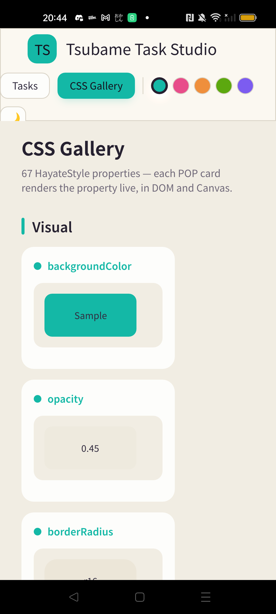
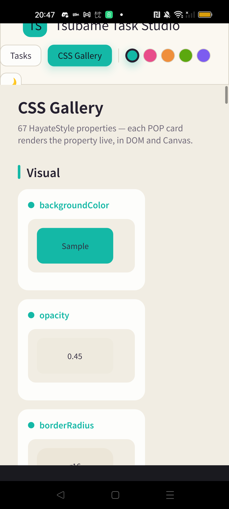
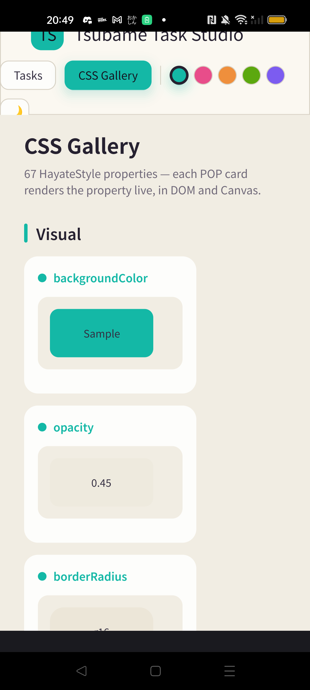
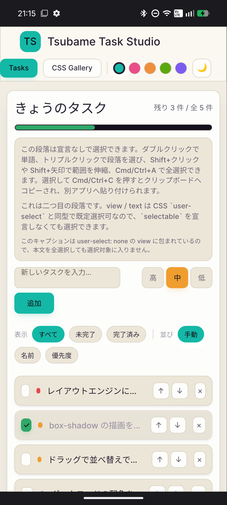
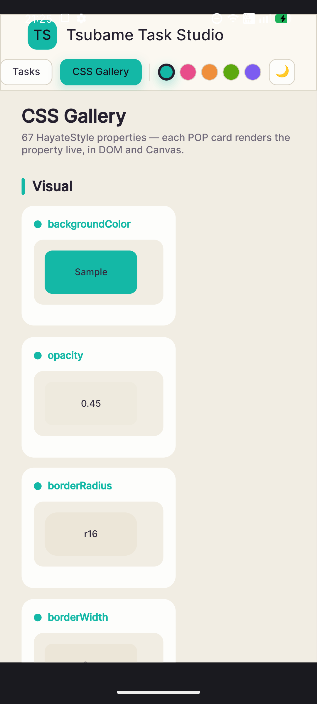

# Android skia-safe の実アプリ実機検証と既定化判断（issue #804）

**Date: 2026-07-14** / **App: Tsubame Task Studio（SolidJS TODO / CSS Gallery）**

issue #804 で、内部描画 fixture ではなく通常の SolidJS TODO アプリを使い、Android の
skia-safe Scene Renderer を実機確認した。renderer と surface は intent extra
（`hayate.renderer=skia`、`hayate.skia_surface=raster|gl`）で固定し、同じ APK・同じ画面を
比較した。

## 端末と結果

| 端末 | OS / GPU（実ログ） | Vello | Skia raster | Skia GL（Ganesh/EGL） |
|---|---|---|---|---|
| OPPO A101OP | Android 12 / Adreno 620 | 正常 | 正常 | 正常 |
| Nothing Phone (3a) A059 | Android 16 / Adreno 810 | CSS Gallery の既知破綻（ADR-0147） | 正常 | 正常 |

両端末で SolidJS TODO と CSS Gallery の日本語テキスト、角丸、影、透過、transform、長い
ページのスクロール、入力欄とキーボード遷移を確認した。raster / GL とも、実機表示上の描画
異常、クラッシュ、surface 初期化失敗は観測しなかった。NP3a の GL 実ログは
`GL renderer=Adreno (TM) 810`、`OpenGL ES 3.2`、`selected scene renderer: skia`、
`skia surface: gl (Ganesh/EGL)` であり、raster fallback ではなく GL 経路が選択されていた。
OPPO でも `GL renderer=Adreno (TM) 620`、`OpenGL ES 3.2` と skia GL 選択ログを確認した。

## スクリーンショット

| 端末 | Vello | Skia raster | Skia GL |
|---|---|---|---|
| OPPO A101OP |  |  |  |
| Nothing Phone (3a) |  |  |  |

SolidJS TODO / CSS Galleryにはカラー絵文字を常時表示する実用画面がないため、本アプリ操作では
カラー絵文字を判定対象にしていない。Skia GLでのカラー絵文字自体は、先行するissue #803の
OPPO実機確認（`🎉😀🚀`、CBDT）を補助証拠とし、本issueの既定化判断は通常アプリの描画と操作を
主証拠にした。

検証途中、画像確認ツールのプレビューを黒い矩形欠落と誤認したが、端末の実表示には存在せず、
元の 1080x2392 PNG を再検査しても広い黒領域は 0 件だった。この所見は renderer の観測結果
ではないため撤回し、本検証の異常には数えない。

## 判断

- Android を含む Native Renderer Selection Order を **skia-safe → vello** にする。
- Android の skia surface 既定は、両端末で正常だった既存の **GL（Ganesh/EGL）** を維持する。
- `hayate.renderer=vello` と `hayate.skia_surface=raster` は診断・比較用の明示指定として残す。
- Skia GL の初回初期化に失敗した場合は raster、それも失敗した場合は vello へ、boot 中だけ
  一方向に次候補を試す。選択後の runtime failure は ADR-0148 の terminal failure 方針に従う。

## 関係

- [ADR-0146](../adr/0146-skia-safe-native-scene-renderer.md)（skia-safe Native Renderer）
- [ADR-0147](../adr/0147-abandon-vello-native-on-adreno-adopt-skia.md)（Android 主力への格上げ）
- [ADR-0149](../adr/0149-skia-safe-native-default.md)（本実測による既定値の確定）
- issue #804（実機検証）
- issue #819（preferred default 反映）
