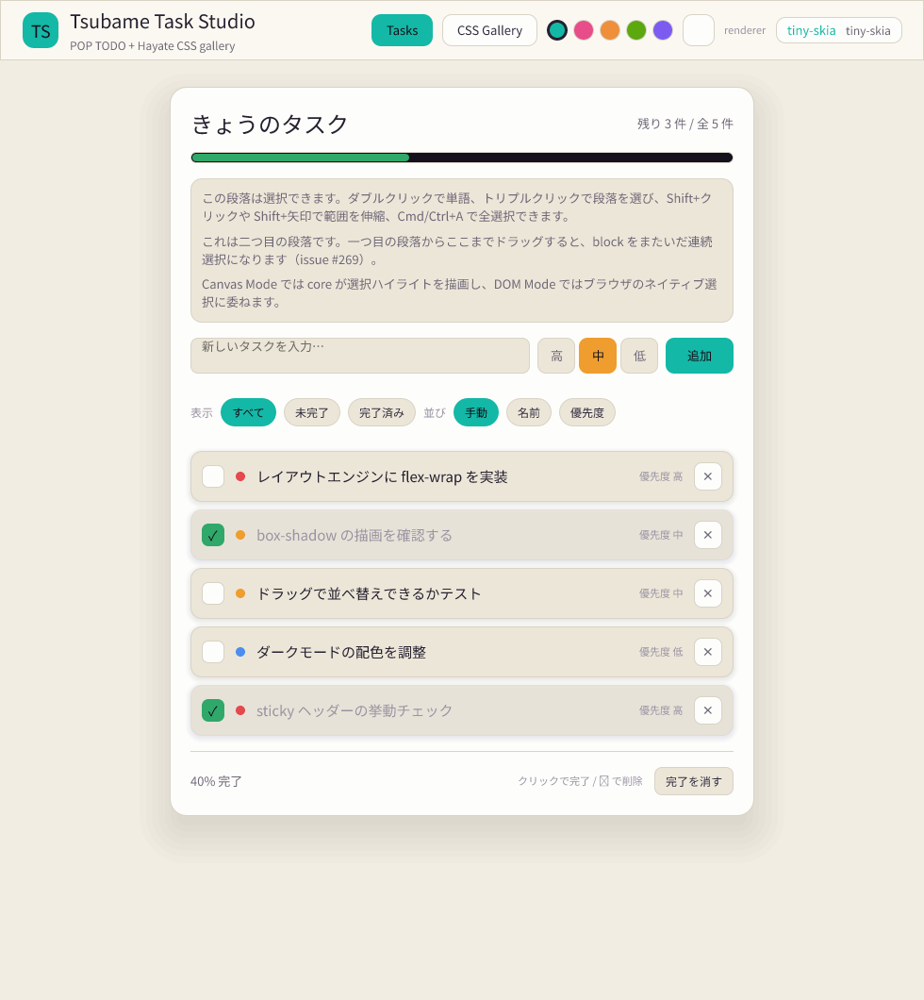
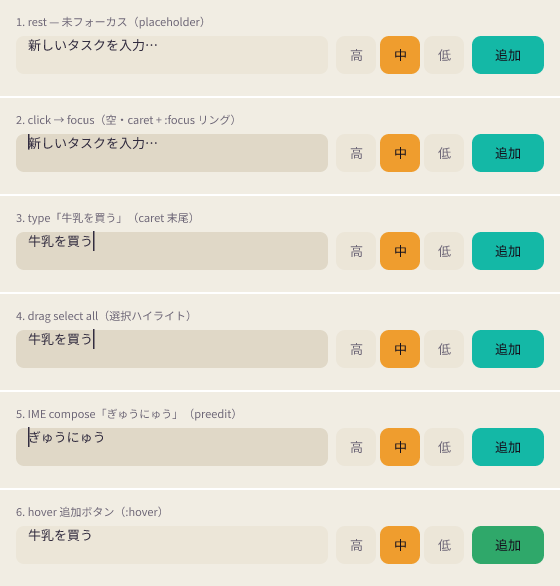

# UI 比較: DOM モード vs tiny-skia (Canvas) モード

hello-world (`Tsubame/examples/hello-world`) の **Tasks 画面**を、両レンダラーで
描画したときの差分から現行 UI の問題点を洗い出す。

- **DOM Renderer**: Hayate スタイルを実 CSS にマップし、ブラウザがレイアウト・描画する。
- **Canvas Renderer (tiny-skia backend)**: Hayate core がレイアウト・SceneGraph を
  生成し、tiny-skia が CPU ラスタライズする。

## 方法

ブラウザを起動できない実行環境のため、tiny-skia は **ネイティブにヘッドレス描画**できる
ことを利用した。`hayate_core::ElementTree` で Tasks 画面（ライトテーマ + teal アクセント、
`App.tsx` / `theme.ts` に忠実）を組み立て、tiny-skia で PNG に焼く再現ハーネスを追加した。

- ハーネス: `Hayate/crates/scene-renderers/tiny-skia/tests/app_screenshot.rs`
- 実行: `HAYATE_WRITE_SCREENSHOT=1 cargo test -p hayate-scene-renderer-tiny-skia --test app_screenshot -- --nocapture`
  （env 無しでは no-op。CI を増やさない）
- 出力:
  - `tiny-skia-tasks.png` … Tasks 画面全体
  - `tiny-skia-glyphs.png` … グリフ被覆プローブ（`🌙 ☀ ✓ ✕ ↑ ↓ あ A`）

DOM 側はブラウザ標準の CSS セマンティクスを基準とし、tiny-skia 出力との乖離を「問題点」とした。
ボタンのラベルは tsubame-solid 同様に **子 `text` 要素**（ADR-0058）として組み、
ボタンの `defaultColor` / `defaultFontSize` を ambient 継承させて忠実に再現している。

## 一致している点（パリティ OK）

flex レイアウト（row/column・`gap`・`align-items`・`justify-content: space-between`）、
`padding` / `margin`、`border-width` / `border-color` / `border-radius`、`box-shadow`
（パネルの浮き・行の影）、`opacity`（完了行 0.62 のフェード）、配色、日本語本文、
記号グリフ（`✓ ✕ ↑ ↓ ☀`）— いずれも DOM 期待どおりに描画され、レイアウトのズレは無い。

## 問題点（DOM と乖離）

### 1.【High】絵文字 🌙 が Canvas モードで描画されない → テーマ切替ボタンが空白

既定はライトテーマ。AppBar のテーマ切替ボタンはライト時に `🌙`（U+1F319）を表示するが、
tiny-skia ではグリフが無く**ボタンが空白**になる（`tiny-skia-tasks.png` 右上 / `tiny-skia-glyphs.png`
先頭が空）。DOM モードはブラウザの emoji フォントで表示されるため、**主要操作のアイコンが
Canvas モードでだけ消える**重大な乖離。

- 根因: 欠落グリフ→フォント取得の要求が emoji で発火しない（詳細は下記「原因診断」）。
- 補足: ダーク時に出る `☀`（U+2600, dingbat）は NotoSansJP にあり描画される。
  つまり**ライト時のみ**アイコンが消える。
- 対応 issue: #329

### 2.【Medium】日本語の line-break / segmentation model が無く、折返しが DOM と乖離

描画時に大量の `ICU4X data error: No segmentation model for language: ja` が出る。
日本語の行分割モデルが読み込まれておらず、既定の break ルールにフォールバックしている。
note 段落でも `クリック` が `ク` / `リック` のように分割されるなど、**折返し位置が
ブラウザ (DOM) の行分割と一致しない**恐れがある（同じ幅でも改行位置がズレる）。

- 影響: 行数・各行の内容が変わると、コンテナ高さや見た目が Canvas/DOM 間でズレる。
- 対応 issue: #330

### 3.【Note】Button 直接テキストは描画されない（ラベルは子 text が正）

検証中に判明: `ElementKind::Button` に `element_set_text` で**直接**載せたテキストは
描画されない。ラベルは子 `text` 要素として描く必要がある（ADR-0058・tsubame-solid と一致）。
アプリは常に子 text 方式なので実害は無いが、レンダリングモデルの前提として記録する。

### 補足（静的 1 枚では検証不可だが既知の設計上の乖離）

`CONTEXT.md` の通り DOM モードは `opacity` / `transform` で stacking context が
生じ Z-Order が Canvas/Hayate と乖離しうる旨を dev 警告する。完了行の `opacity: 0.62`
はこの条件に該当するため、重なり順が関わる UI を足す際は DOM/Canvas 差に注意。

## 原因診断 (diagnose)

`/diagnose` の規律で上記 2 件を根本原因まで追った。フィードバックループは
`diagnose_glyph_ink`（グリフ単体を描いて ink ピクセル数を数える決定的シグナル）と
描画時の ICU4X ログ。

### 問題 1 の根因: 欠落グリフ→フォント DL の要求が emoji で発火しない

> 当初「fonts.json に emoji が無い」と書いたが、これは**症状**で根本ではない。
> Canvas モードは欠落フォントを**オンデマンドで DL する**仕組みを持つ。真の根因は
> その DL 要求が emoji に対して**一度も発火しない**こと。

`diagnose_glyph_ink` の出力（`HAYATE_WRITE_SCREENSHOT=1` 必須）:

```
[GLYPH-INK]     0 px  U+1F319 🌙 emoji moon      ← 空白（バグ）
[GLYPH-INK]     0 px  U+1F311 🌑 emoji new moon  ← 空白
[GLYPH-INK]   585 px  U+2600 ☀ sun dingbat       ← 描画される（base font 内）
[GLYPH-INK]   138 px  U+263D ☽ /  148 px U+263E ☾ /  169 px ✓ /  234 px ✕ / ク A
```

**DL 経路（設計）**: `core/.../text.rs::lower_glyph_runs` が `.notdef`(glyph id 0) を検知
→ その codepoint を `codepoint_font_family(cp)` で補完フォント名に引く → `missing_families`
→ `layout_pass` が `Event::FetchFont{family}` を発火 → web アダプタ
`canvas.rs::poll_events` が `builtin_font_url(family)` で URL を引き fetch → `font_queue`
→ 次フレームの `render()` 冒頭で `register_font` → 再レイアウトで正しいグリフ。
CJK (Noto Sans JP) はこの経路で実際に動いている。

**根因**: `core/.../text.rs::codepoint_font_family` の範囲表に **emoji の arm が無い**
（CJK / ハングル / アラビア / タイ / デーヴァナーガリー / ヘブライのみ。emoji は `_ => None`）。
よって 🌙 (U+1F319) は補完フォント名が `None` → `FetchFont` が**発火せず** → DL もされず空白。
☀ (U+2600) が出るのは base font (NotoSansJP) に元から有り `.notdef` にならないため。
DOM はブラウザが OS emoji へ fallback するため表示され、ここが乖離。

**tiny-skia 制約**: painter は `outline_glyphs()`（glyf/CFF アウトライン）のみ描画し、
COLR/CBDT の**カラー emoji は描けない**。よって補完先は**モノクロの "Noto Emoji"**で
なければならず、"Noto Color Emoji" では tiny-skia で依然空白になる。

→ 修正方針と受け入れ条件は **issue #329** に集約。本ドキュメントは分析のみで、コード変更は含まない。

### 問題 2 の根因: parley が CJK 辞書を読み込まない line segmenter を使用

ICU4X ログ `No segmentation model for language: ja` の発生源は
`icu_segmenter-2.2.0/src/complex/mod.rs::select()`：`ChineseOrJapanese` に対し
`cjdict`(CJK 辞書) payload が `None` だと当該エラーを出し、CJK 連を 1 セグメント扱いに
フォールバックする（＝辞書による語境界を使わず UAX#14 既定で kana 間を切る）。

なぜ `None` か。vendored parley の
`crates/vendor/parley/src/analysis/mod.rs::line_segmenter()` が **全 word-break モードで
`LineSegmenter::new_for_non_complex_scripts(opt)` を使う**ため、複雑スクリプト用 (CJK/東南
アジア) の辞書データを一切ロードしない。結果、日本語は辞書非対応で UAX#14 既定折返しになり、
`クリック` が `ク`/`リック` のように分割され、ブラウザ(DOM)の ICU 辞書折返しと改行位置が乖離する。

→ 対応方針の検討と受け入れ条件は **issue #330** に集約。

### 回帰シグナル

`diagnose_glyph_ink`（ink 数）と `render_glyph_coverage` / `render_tasks_screen`（目視）を
そのまま回帰確認に使える。問題 1 を修正したら `🌙` ではなく採用 dingbat の ink が
0 でないこと、Tasks 画面でトグルにアイコンが出ることを確認する。

## インタラクション比較（クリック / 入力 / 選択 / IME / hover）

静的 1 枚では出ない**操作中の状態**を比較した。AddForm の `text-input`（`App.tsx`
の `inputStyle()` ＝ `:focus` で border→accent / bg→panel3、`onKeyDown` Enter）と
`追加` ボタン（`:hover` で bg→success）を忠実に組み、core の interaction API
（`element_focus` / `on_pointer_down_on`＋`on_pointer_move`＋`on_pointer_up` の
ドラッグ選択 / `element_set_text_content` / `element_set_preedit` /
`hover_enter_element`）で操作を与えてから tiny-skia で焼いた。

- ハーネス: 同 `app_screenshot.rs` の `render_interaction_states`（6 状態を縦に連結）
  と `diagnose_interaction_signals`（決定的シグナル）。
- 出力: `interaction-states.png`。
- 状態: ①rest（placeholder）②click→focus（空・caret＋:focus）③入力「牛乳を買う」
  （caret 末尾）④全選択ドラッグ（選択ハイライト）⑤IME 変換中「ぎゅうにゅう」（preedit）
  ⑥`追加` ボタン hover。

`diagnose_interaction_signals` の出力（`HAYATE_WRITE_SCREENSHOT=1` 必須）:

```
[PLACEHOLDER-RGB] placeholder=(50,44,63) committed=(50,44,63)   ← 同色（バグ）
[FOCUS-FILL]      unfocused=(236,230,216) focused=(224,216,199) ← panel2→panel3 は効く
[CARET-INK]       focused-empty=394 unfocused-empty=351         ← Δ≈43px の caret は描かれる
[SELECTION-PX]    material-blue-tint px=2599                    ← Material tint で描く
[PREEDIT-INK]     preedit-ink=311（下線ノードは無し）            ← preedit が素のテキスト
```

### 4.【High】placeholder が本文と同色で描かれる（muted にならない）

空の入力欄は placeholder「新しいタスクを入力…」を表示するが、Canvas では
`color`（本文色 `#322c3f`）**そのまま**で描く（`[PLACEHOLDER-RGB]` が committed と
完全一致）。DOM はブラウザ既定の `::placeholder`（概ね半透明グレー ~`#9a93a3`）で
**淡く**描くため、入力前の見た目が大きく乖離し、placeholder と実入力の区別がつかない。

- 根因: `layout_pass.rs` が `is_placeholder`（`display_text` が空）のとき `el.text`
  を `text_layout` に積むだけで、`scene_build.rs` の TextInput 分岐は `confirmed_color`
  （＝本文色）で塗る。placeholder 専用色のチャネルが無い。
- 比較軸: Hayate CSS に `::placeholder` 相当も placeholder-color プロパティも無い。

### 5.【Medium】focus リングが弱い（1px accent border が 1× でほぼ消える）＋ ネイティブ focus outline 非対応

`:focus` 自体は効く — 背景は panel2→panel3 に切り替わる（`[FOCUS-FILL]`）。ただし
もう一方の手掛かりである **1px の accent ボーダーは 1× でほとんど描かれない**
（左端が整数 x=16 に乗り、ヘアラインが塗りに飲まれてボーダー列を作らない。
border 列を直接走査しても accent ピクセルは検出されない）。結果、focus の合図は
ほぼ背景差のみで、DOM よりコントラストが低い。加えて DOM はアプリの `:focus` に
**ブラウザのネイティブ focus outline** を重ねるが、Canvas はそれを描かない（設計上
ネイティブ widget chrome は再現しない方針だが、キーボード focus の可視性は別途要検討）。

- 観察: 1px ボーダーが整数座標の左端で消える件は placeholder/focus に限らず、細い
  ボーダー全般の 1× ラスタライズ課題の可能性（深追いは本分析のスコープ外）。

### 6.【Medium】テキスト選択ハイライトが固定 Material tint（DOM は OS / `::selection`）

全選択ドラッグで Canvas は core 描画の**固定 Material tint**
（`SELECTION_HIGHLIGHT_COLOR = rgba(0.20,0.45,0.95,0.35)`）を text の背後に敷く
（`[SELECTION-PX]`）。これは CONTEXT の「Selection Chrome は core が一度だけ描画し、
DOM 経路はブラウザのネイティブ選択に委ねる」設計どおりで、**意味論パリティの対象外**。
ただし見た目は DOM（OS アクセント / `::selection`）と必ず異なり、panel3 のベージュ地に
0.35α の青を重ねると彩度が落ちて視認性が低めになる点は実用上の注意点。

### 7.【High】IME preedit が素のテキストで描かれる（変換中の下線が出ない）

変換中（committed「」＋ preedit「ぎゅうにゅう」）を Canvas は `display_text` ＝
`content + preedit` を**一続きの素のテキスト**として描き、preedit 区間に下線・
背景などの装飾を一切付けない（`edit_state.rs::display_text` は連結のみ、
`scene_build.rs` は単一 run、装飾ノードを emit しない）。DOM / EditContext は変換中の
composition を**下線**で示すため、「どこが未確定か」が Canvas では分からない。
Canvas Mode は EditContext API で IME を扱う前提のため、未確定区間の描画契約は別途必要。

### Note: 動くと確認できた点（パリティ OK）

caret は core が描画し（`[CARET-INK]` Δ≈43px、末尾入力でも字間に正しく出る）、
`:focus` の背景切替・`:hover`（`追加` が success へ）・全選択ドラッグの範囲計算は
期待どおり動作する。問題は上記の**色・装飾チャネルの欠落**に集中する。

## スクリーンショット





